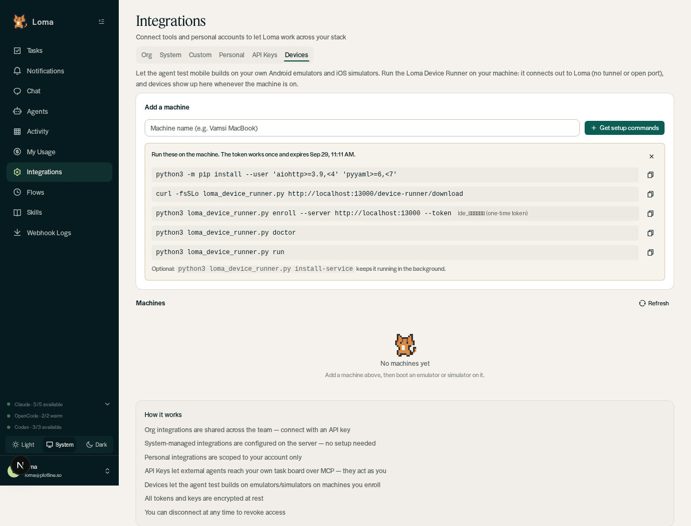
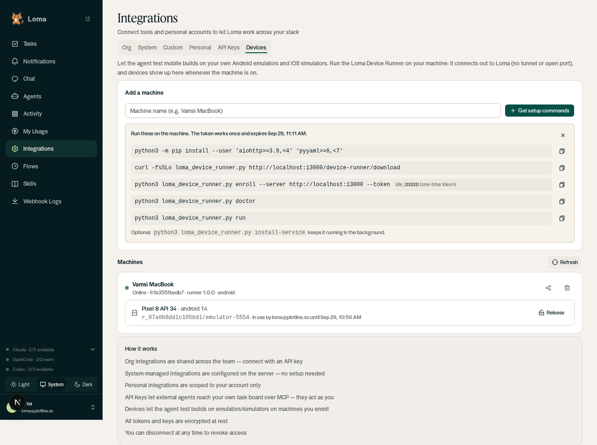

# Loma Devices

Loma Devices lets the agent test mobile builds end to end on **Android emulators and iOS
simulators running on machines your users control** (a laptop, a Mac mini, a KVM Linux box).
The agent can install a PR build, launch it, open deep links, tap/type/swipe, read the UI
tree, take screenshots, read logs and run Maestro flows. Screenshots and results can then
be posted to the PR as evidence.

## Architecture

```
Agent (isolated worker: device.* tools | legacy runtime: tools/device.py)
   │
   ▼
Loma backend ── DeviceService: ACL (owner + shared_with), per-chat leases, arg validation, audit
   │            RunnerHub: one outbound WebSocket per runner, request/response RPC
   │            BlobStore: GitHub artifact → checksummed, runner-bound, short-lived blob
   ▲  wss://<loma>/device-runner/ws (runner secret)      https://<loma>/device-runner/blobs/<id>
   │
Loma Device Runner (device_runner/loma_device_runner.py) on the user's machine
   └─ fixed op allowlist → adb / xcrun simctl / idb / maestro
```

- **Outbound only.** The runner dials Loma; nothing listens on the user's machine. No
  tunnel, DNS or firewall changes. Works behind NAT/VPN.
- **The worker never sees binaries or credentials.** It names a build (repo, artifact name,
  PR or run id). The backend downloads it with its own GitHub token and hands the runner a
  checksummed blob that only that runner can fetch, a limited number of times.
- **One policy layer.** Isolated workers, the legacy CLI and the dashboard all go through
  `devices/service.py`.

## Setup

1. Operator: optionally set `LOMA_DEVICE_BUILD_REPOS=owner/repo,...` (repos whose GitHub
   Actions artifacts may be installed; empty = no CI installs) and `LOMA_DEVICE_BLOB_DIR`
   (defaults to the system temp dir). The backend's `GITHUB_API_KEY` must be able to read
   those repos' artifacts. nginx must route `/device-runner/` to the backend (included in
   `deploy/nginx`).
2. User: **Integrations → Devices → Get setup commands**, run them on the machine, boot an
   emulator/simulator. See `device_runner/README.md` for details, policy options and
   `install-service`.




## Security model

| Threat | Control |
|---|---|
| Stolen enrollment token | Single use, 30 min expiry, stored hashed |
| Runner impersonation | Per-runner secret (hashed at rest, constant-time compare); revocation closes the socket and the runner exits |
| Agent runs arbitrary commands on the user's machine | Fixed op allowlist, argv-only subprocesses, device-side args shell-quoted, server- and runner-side validation |
| Agent touches a personal phone | Physical devices hidden unless `allow_physical_devices` |
| Agent installs/launches other apps | Optional `allowed_app_ids`, checked against the package/bundle actually installed |
| Maestro JS / file access | YAML-parsed command allowlist; scripts, sub-flows, media, recordings and `${...}` blocked by default; `file:`/`javascript:`/`data:` URLs blocked |
| Malicious build archive | Checksum, 500 MB cap, zip-slip/symlink rejection, shared nested-zip budget |
| Another user drives my devices | Owner or explicit `shared_with` only; leases per chat; audit log per call (90 day TTL) |
| Oversized results break a run | Device results capped (~200 KiB) below the worker frame limit |

## Known limits

- **Single backend process.** Runner sockets live in the process that accepted them. With
  several backend replicas, calls must be routed to the replica holding the socket (not
  implemented; calls elsewhere report the runner offline).
- **Legacy runtime lease scope is advisory** between one user's own chats (`--scope`);
  other users are always isolated. Isolated workers bind the scope server-side.
- **Isolated workers cannot view images.** Screenshots are shown to the user as chat
  files; the model asserts on `ui_tree`.
- **Worker tool catalog is at 62/64.** Device actions are grouped into 8 tools for that reason.
- **iOS** taps, swipes, typing, keys and UI tree need `idb` on the runner; physical iOS devices are not supported.
- Build blobs live in memory + temp disk for up to 2 hours and are lost on restart
  (the agent just requests the build again).
