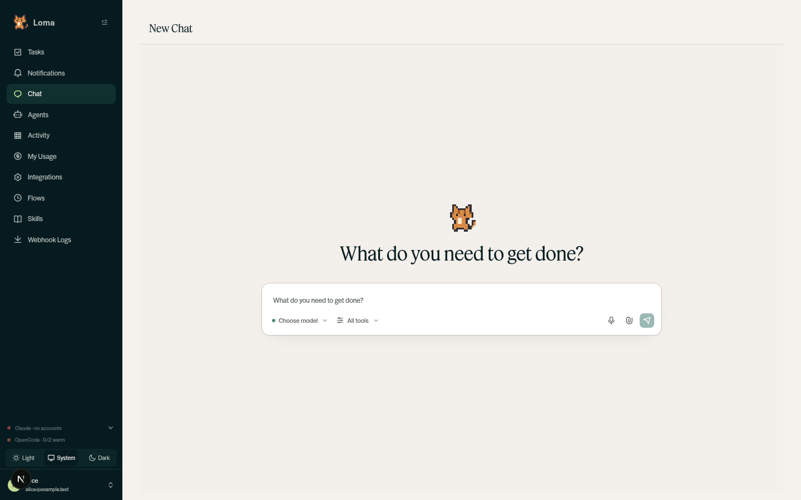
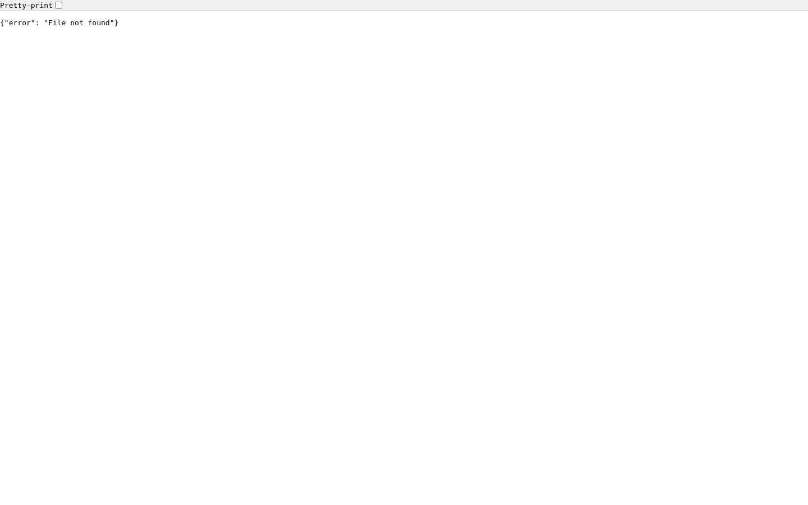

# Host-terminal and file-download containment

## Scope

This is the first containment change, not a claim that worker/user isolation is
complete. It disables the host-terminal HTTP token endpoint and WebSocket
upgrade for every role, and makes registered file delivery owner-only.

Files receive an opaque random ID and the authenticated stream user's email.
Every GET, HEAD, and range request checks that owner before opening a file.
Unowned records, unknown IDs, and encoded paths fail closed. The legacy file
route delegates to the same handler; route registration is idempotent.
The download opens a non-symlink regular file relative to the served directory
and streams that checked descriptor, rather than reopening its path. Responses
are private/no-store and active HTML/SVG previews are sandboxed.

## Intentional compatibility changes

- Browser host terminals are unavailable, including for admins. Terminal-based
  Claude/Codex connection and reauthentication cannot complete. Do not work
  around this by restoring a host shell.
- Persisted encoded-path links and unowned files no longer work. Users must
  regenerate files. No automatic legacy ownership inference or backfill.
- This small patch retains the process-local registry. A restart loses its
  registrations; multiple workers do not share registrations. Persistent,
  authorized artifact storage is follow-up work, not a path fallback.
- Artifact access is owner-only, including files linked in shared conversations.
  Admin role and conversation sharing do not override this containment policy.
- Script-driven HTML previews may no longer function; static content still renders.

## Verification

2026-09-12, based on main `cf095826`:

- Full backend suite: **454 passed**, Python 3.12.
- Real aiohttp HTTP/WebSocket regression coverage includes all five roles,
  anonymous access, exact-ID cross-user access, GET/HEAD/ranges, conditional
  requests, legacy path encodings, missing ownership, registry loss, missing
  files, symlink/root-symlink escapes, directory/FIFO rejection, and active
  content headers. Claude artifact and OpenCode text delivery preserve owner.
- Real backend (`app.main`) plus Next.js dashboard tested on local ports
  13000/13001. A separate localhost MongoDB on 27028 held only synthetic data.
  Processes used a fresh environment, empty Claude/Codex homes, synthetic auth
  secrets, no integration credentials, and disabled Slack/scheduler/webhooks.
- Playwright used normal setup-token login and two independent browser sessions.
  Fourteen assertions passed: login/home, owner PDF download and bytes, PDF range,
  unrelated user denial, forged identity header replacement at the dashboard,
  both users' terminal token and WebSocket-route denial, admin artifact/terminal
  denial, encoded-path denial, and anonymous denial.
- No model calls, external personal integrations, or production security probes.

The screenshots accompanying the PR show the logged-in synthetic account and a
cross-user file denial. This is isolated **local full-stack verification**, not
certification of the shared remote preview/staging environment. That environment
uses live integration credentials and was not used for adversarial tests.

Reproduce the automated suite in an isolated environment:

```bash
uv venv --python 3.12
uv pip install -r requirements.txt pytest pytest-asyncio
.venv/bin/python -m pytest tests -q
```

For full-stack verification, use the local-stack runbook with a fresh database,
empty account directories and no external credentials. Before starting
`app.main`, register a synthetic PDF with `register_served_file(...,
owner_email="alice@example.test")` in the same process. Log in through the real
Next.js setup flow as Alice, then provision synthetic Bob in that throwaway DB
with local password auth. Confirm Alice receives 200/206, Bob (also after admin
promotion) receives 404, anonymous requests receive 401, and terminal token/WS
requests receive 403. Never add a production endpoint for test fixture creation.

## Rollout gate and remaining risk

1. Review compatibility changes and passing CI before merge.
2. Stop old backend workers and their terminal child processes during deployment;
   do not leave old workers accepting WebSockets. Existing sessions on old code
   are not remotely terminated by opening this PR.
3. Verify allowed/denied requests using dedicated synthetic users on staging
   with integration credentials removed. Keep production untouched until sign-off.
4. Review exposure logs and rotate potentially exposed credentials after closing
   exposure paths, in a separately approved operational action.
5. Roll back by disabling affected features, not by restoring unsafe handlers.

Unrestricted agents can still read shared files/secrets and cause files to be
registered during a turn. Binding a download to the requester does not establish
filesystem provenance or isolate arbitrary worker code. Credential brokering,
worker filesystem/network isolation, backend gateway identity hardening, and
chat/integration authorization remain essential follow-up changes.

## Browser evidence

Logged-in synthetic account with no connected model accounts:



Bob requesting Alice's exact file ID receives a non-disclosing error:


