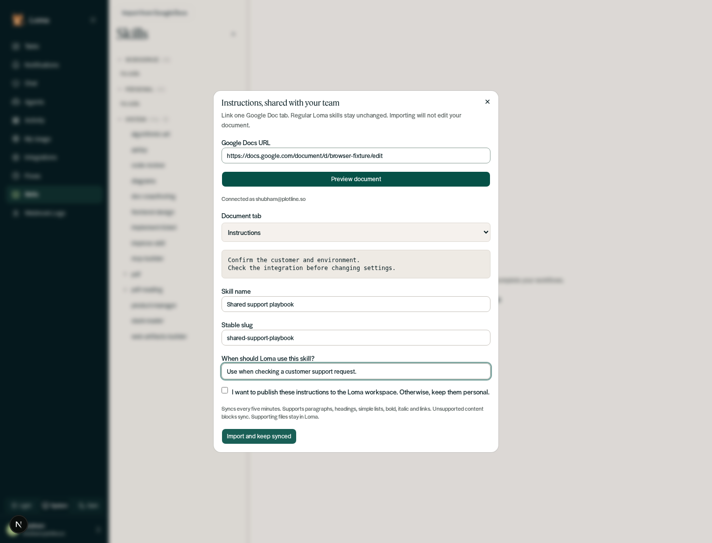
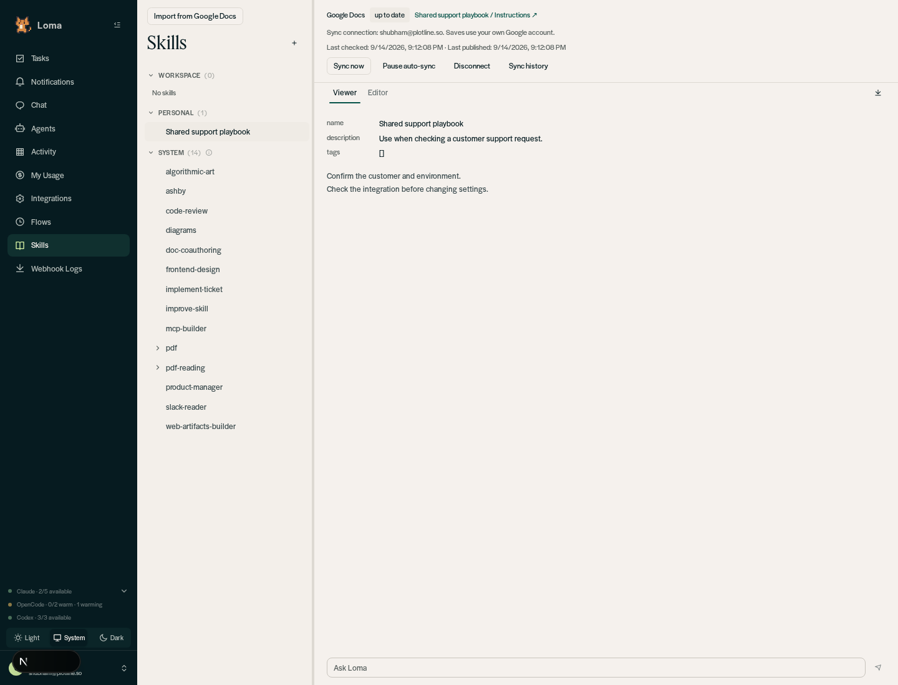
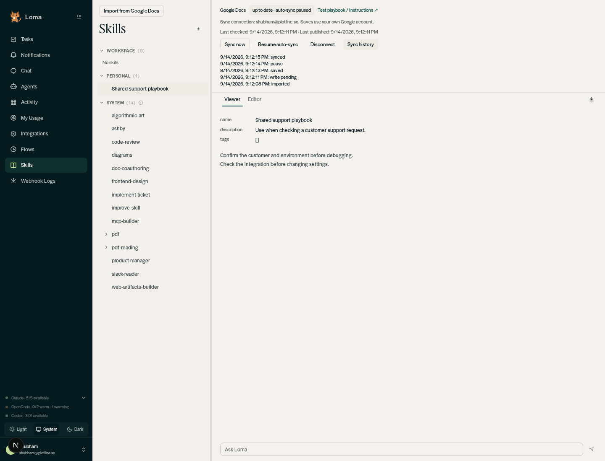
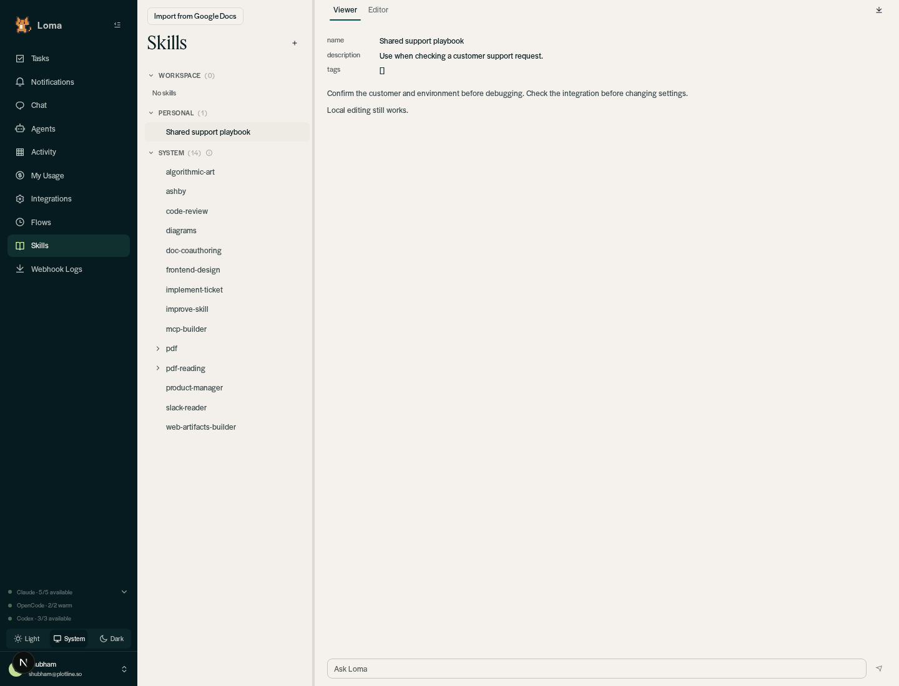

# Google Docs skills verification

Verified on 2026-09-14.

- Python suite: **573 passed**, 14 warnings.
- Dashboard TypeScript: `tsc --noEmit` passed.
- Live Google API: rich formatting, Unicode, whitespace, selected-tab isolation,
  no-op round-trip, stale revision rejection, and terminal paragraph edits passed.
  Only a disposable document owned by the authenticated requester was used; it was
  moved to trash after verification.
- Real-browser test: local setup-token login, preview, personal import, save to
  Google Docs, pause, manual sync, sync history, disconnect and regular local save.
  Backend and dashboard used an isolated `loma_local_*` database with Slack and
  scheduler disabled. The browser run replaced only the Google upstream adapter
  with the test suite's in-memory fixture. Source/API/service/database/UI paths
  were real; screenshots are synthetic support instructions, not customer data.
- Conflict, permissions, lease fencing and recovery are covered by offline tests.
  Five-minute scheduler timing was not exercised in the browser (scheduler disabled).

## Screenshots

