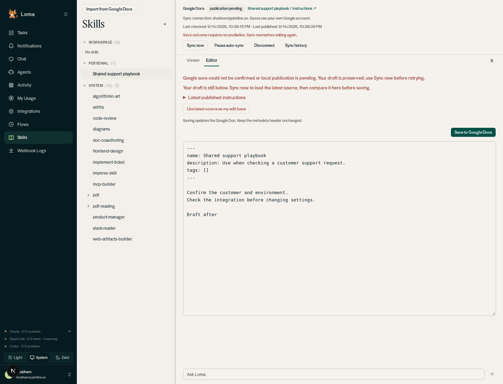
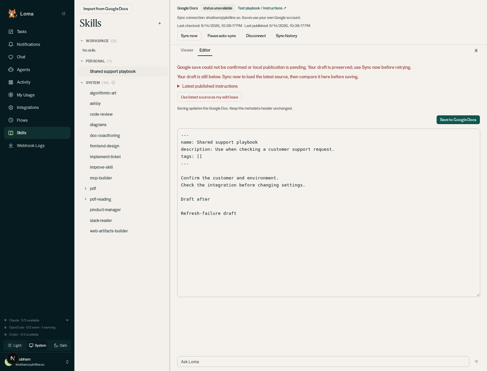
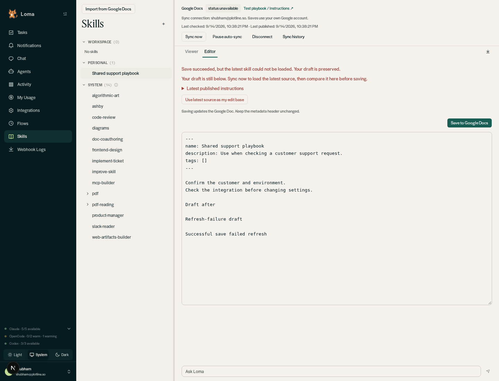

# Save-status regression verification

Verified in Chromium against the isolated Loma backend and dashboard, with a disposable `loma_local_*` database. Slack and scheduling were disabled. This focused regression run used the existing in-memory Google adapter fixture, not live Google Docs. Failures were injected at the adapter write boundary and the browser's skill-detail GET request. No personal Google documents or permissions were changed.

## Passed browser assertions

- Failure before a Google write: badge becomes `publication pending`; editor and exact draft remain; manual sync reconciles.
- Lost acknowledgement after a Google write: same badge and draft assertions; manual sync recovers committed source content.
- Failed write plus failed detail refresh: badge says `status unavailable`, not `up to date`; draft stays visible.
- Successful save plus failed detail refresh: explicitly reports save success but refresh failure, preserving the editor and draft.
- Successful refresh clears the unknown-status fallback.
- Normal linked save switches to Viewer after refreshing successfully.
- Disconnect and regular local save continue working.

Automated verification: `env -u PYTHONPATH -u AGENT_DEFAULT_MODEL .venv/bin/python -m pytest --asyncio-mode=auto -q` and dashboard `tsc --noEmit`. The backend timeout test now asserts the public detail response exposes `publication_pending`, retains the prior content/hash, and returns to `up_to_date` after reconciliation.

The initial pytest invocation needed `--asyncio-mode=auto`. The initial full-suite invocation inherited the host's `AGENT_DEFAULT_MODEL`, causing the unrelated default-runtime test to fail; the clean-environment rerun removes that override.

